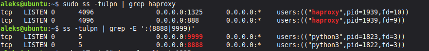
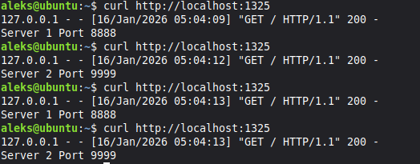
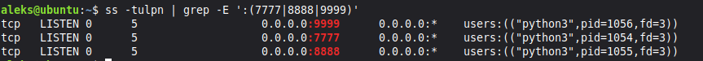
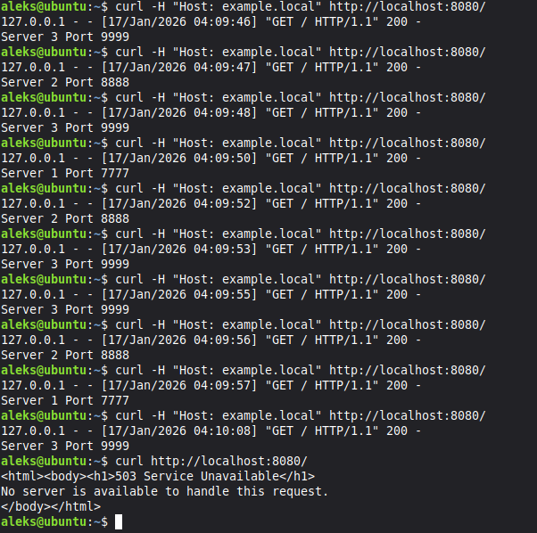

# Домашнее задание к занятию 2
## «Кластеризация и балансировка нагрузки»

# Задание 1

Задание 1
 1. Запустите два simple python сервера на своей виртуальной машине на разных портах
 2. Установите и настройте HAProxy, воспользуйтесь материалами к лекции по ссылке
 3. Настройте балансировку Round-robin на 4 уровне.
На проверку направьте конфигурационный файл haproxy, скриншоты, где видно перенаправление запросов на разные серверы при обращении к HAProxy.

**Решение:**

*вывод ss*

*вывод curl*

*haproxy stats*

## Конфигурация HAProxy

Полный конфигурационный файл: [haproxy1.cfg](./haproxy1.cfg)

# Задание 2

Задание 2
 1. Запустите три simple python сервера на своей виртуальной машине на разных портах
 2. Настройте балансировку Weighted Round Robin на 7 уровне, чтобы первый сервер имел вес 2, второй - 3, а третий - 4
 3. HAproxy должен балансировать только тот http-трафик, который адресован домену example.local
На проверку направьте конфигурационный файл haproxy, скриншоты, где видно перенаправление запросов на разные серверы при обращении к HAProxy c использованием домена example.local и без него.

**Решение:**

*вывод ss*

*вывод curl*

## Конфигурация HAProxy

Полный конфигурационный файл: [haproxy2.cfg](./haproxy2.cfg)

