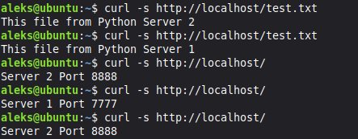

# Домашнее задание к занятию 2
## «Кластеризация и балансировка нагрузки»

# Задание 1

Задание 1
 1. Запустите два simple python сервера на своей виртуальной машине на разных портах
 2. Установите и настройте HAProxy, воспользуйтесь материалами к лекции по ссылке
 3. Настройте балансировку Round-robin на 4 уровне.
 На проверку направьте конфигурационный файл haproxy, скриншоты, где видно перенаправление запросов на разные серверы при обращении к HAProxy.

**Решение:**

*вывод ss*

*вывод curl*

*haproxy stats*

## Конфигурация HAProxy

Полный конфигурационный файл: [haproxy1.cfg](./haproxy1.cfg)

# Задание 2

Задание 2
 1. Запустите три simple python сервера на своей виртуальной машине на разных портах
 2. Настройте балансировку Weighted Round Robin на 7 уровне, чтобы первый сервер имел вес 2, второй - 3, а третий - 4
 3. HAproxy должен балансировать только тот http-трафик, который адресован домену example.local
 На проверку направьте конфигурационный файл haproxy, скриншоты, где видно перенаправление запросов на разные серверы при обращении к HAProxy c использованием домена example.local и без него.

**Решение:**

*вывод ss*

*вывод curl*

## Конфигурация HAProxy

Полный конфигурационный файл: [haproxy2.cfg](./haproxy2.cfg)

# Задание 3

Задание 3*
 1. Настройте связку HAProxy + Nginx как было показано на лекции.
 2. Настройте Nginx так, чтобы файлы .jpg выдавались самим Nginx (предварительно разместите несколько тестовых картинок в директории /var/www/), а остальные запросы переадресовывались на HAProxy, который в свою очередь переадресовывал их на два Simple Python server.
 На проверку направьте конфигурационные файлы nginx, HAProxy, скриншоты с запросами jpg картинок и других файлов на Simple Python Server, демонстрирующие корректную настройку.

**Решение:**

## Конфигурация nginx /etc/nginx/sites-available/default

Полный конфигурационный файл: [default](./default)

## Конфигурация HAProxy

Полный конфигурационный файл: [haproxy3.cfg](./haproxy3.cfg)

*.jpg отдаёт nginx*

*.txt отдают python servers, балансировка простой roundrobin*

